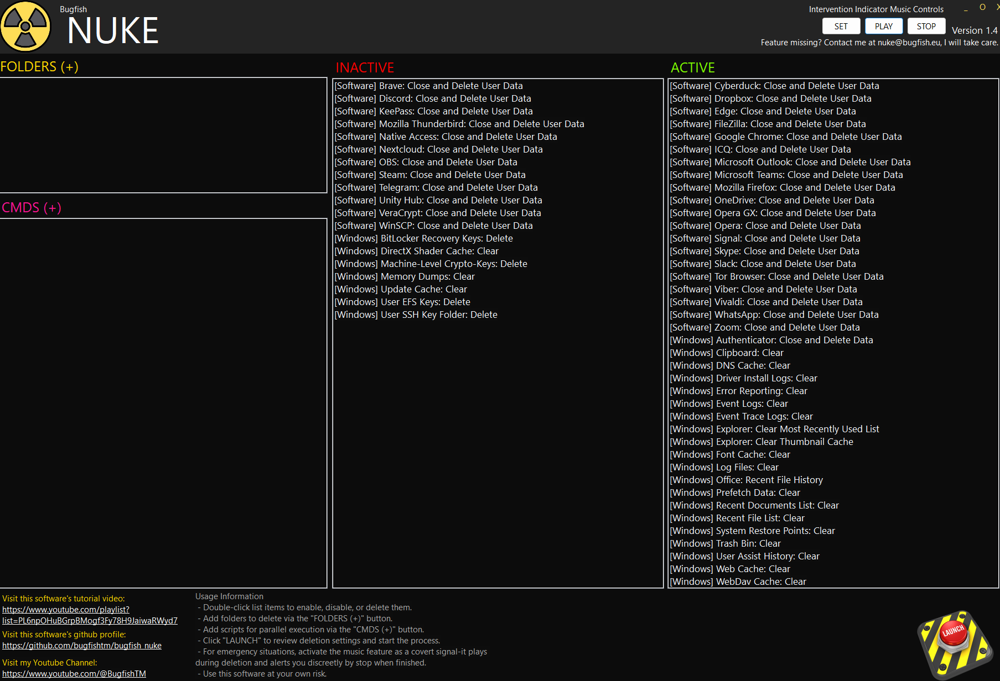

# Bugfish Nuke

Bugfish Nuke: Instant, Secure Data Erasure When It Matters Most.

!!! danger "Do not use this tool for hacking, unauthorized access, or any criminal activity. Misuse may result in data loss, system inaccessibility, or legal consequences. Always comply with local laws and use only on systems you own or are authorized to manage."

-----------

## Introduction

Bugfish Nuke is a powerful emergency data deletion tool for Windows, designed to help you quickly and securely erase sensitive files, user data, and system traces. Whether you need to protect your privacy or respond to a critical situation, Bugfish Nuke offers fast, configurable, and reliable data destruction. |

-----------

## Features

This tool provides instant, secure erasure of user data, application traces, and sensitive files with a single click. It uses advanced deletion methods, overwriting files rather than simply moving them to the recycle bin, and allows users to set the number of overwrite passes for each operation—balancing speed and security according to their needs. For added flexibility, users can integrate their own scripts, such as automatically dismounting encrypted volumes during the cleanup process.

An optional, advanced feature lets users corrupt Windows login files after deletion, effectively locking out further access to the system (intended for emergency scenarios only). To enhance the user experience, the tool can play a custom or built-in music track during deletion, providing an audible signal when the process is complete. Before any action is executed, users receive a clear overview of what will happen, and can configure post-deletion behaviors such as auto-closing the tool or forcing a system restart. Direct access to tutorials and help resources is also available for guidance and support.

**Warning:** Use the "Corrupt Windows System" option only in extreme situations. This action is irreversible and will require a full system reinstall.

| Name | Shortcode | Description (from code logic) |
|---|---|---|
| [Software] Brave: Close and Delete User Data | brave | Kill process: `brave`. Securely delete `%LocalAppData%\BraveSoftware\Brave-Browser\User Data` |
| [Software] Cyberduck: Close and Delete User Data | cyberduck | Kill process: `Cyberduck`. Securely delete `%AppData%\Cyberduck` |
| [Software] Discord: Close and Delete User Data | discord | Kill process: `Discord`. Securely delete `%AppData%\discord` |
| [Software] Dropbox: Close and Delete User Data | dropbox | Kill process: `Dropbox`. Securely delete `%AppData%\Dropbox` |
| [Software] Edge: Close and Delete User Data | edge | Kill process: `msedge`. Securely delete `%LocalAppData%\Microsoft\Edge\User Data` |
| [Software] FileZilla: Close and Delete User Data | filezilla | Kill process: `filezilla`. Securely delete `%AppData%\FileZilla` |
| [Software] Google Chrome: Close and Delete User Data | chrome | Kill process: `Chrome`. Securely delete `%LocalAppData%\Google\Chrome\User Data` |
| [Software] ICQ: Close and Delete User Data | icq | Kill process: `icq`. Securely delete `%AppData%\ICQ` |
| [Software] KeePass: Close and Delete User Data | keepass | Kill process: `KeePass`. Securely delete `%AppData%\KeePass` |
| [Software] Microsoft Outlook: Close and Delete User Data | outlook | Kill process: `OUTLOOK`. Securely delete `%LocalAppData%\Microsoft\Outlook` |
| [Software] Microsoft Teams: Close and Delete User Data | teams | Kill process: `Teams`. Securely delete `%AppData%\Microsoft\Teams` |
| [Software] Mozilla Firefox: Close and Delete User Data | firefox | Kill process: `firefox`. Securely delete `%AppData%\Mozilla\Firefox\Profiles` |
| [Software] Mozilla Thunderbird: Close and Delete User Data | thunderbird | Kill process: `thunderbird`. Securely delete `%AppData%\Thunderbird\Profiles` |
| [Software] Native Access: Close and Delete User Data | nativeaccess | Kill process: `NativeAccess`. Securely delete `%AppData%\NativeAccess` |
| [Software] Nextcloud: Close and Delete User Data | nextcloud | Kill process: `Nextcloud`. Securely delete `%AppData%\Nextcloud` |
| [Software] OneDrive: Close and Delete User Data | onedrive | Kill process: `OneDrive`. Securely delete `%LocalAppData%\Microsoft\OneDrive` |
| [Software] OBS: Close and Delete User Data | obs | Kill process: `OBS`. Securely delete `%AppData%\obs-studio` |
| [Software] Opera: Close and Delete User Data | opera | Kill process: `opera`. Securely delete `%AppData%\Opera Software\Opera Stable` |
| [Software] Opera GX: Close and Delete User Data | operagx | Kill process: `opera`. Securely delete `%AppData%\Opera Software\Opera GX Stable` |
| [Software] Signal: Close and Delete User Data | signal | Kill process: `Signal`. Securely delete `%AppData%\Signal` |
| [Software] Skype: Close and Delete User Data | skype | Kill process: `skype`. Securely delete `%AppData%\Skype` |
| [Software] Slack: Close and Delete User Data | slack | Kill process: `slack`. Securely delete `%AppData%\Slack` |
| [Software] Steam: Close and Delete User Data | steam | Kill process: `Steam`. Securely delete `%AppData%\Steam` and `%LocalAppData%\Steam` |
| [Software] Telegram: Close and Delete User Data | telegram | Kill processes: `Telegram`, `TelegramDesktop`. Securely delete `%AppData%\Telegram Desktop` |
| [Software] Tor Browser: Close and Delete User Data | tor | Kill process: `firefox` (Tor uses Firefox). Securely delete `%AppData%\Tor Browser` |
| [Software] Unity Hub: Close and Delete User Data | unityhub | Kill process: `Unity Hub`. Securely delete `%AppData%\UnityHub` |
| [Software] VeraCrypt: Close and Delete User Data | veracrypt | Kill process: `VeraCrypt`. Securely delete `%AppData%\VeraCrypt` |
| [Software] Viber: Close and Delete User Data | viber | Kill process: `Viber`. Securely delete `%AppData%\ViberPC` |
| [Software] Vivaldi: Close and Delete User Data | vivaldi | Kill process: `vivaldi`. Securely delete `%LocalAppData%\Vivaldi\User Data` |
| [Software] WhatsApp: Close and Delete User Data | whatsapp | Kill process: `WhatsApp`. Securely delete `%AppData%\WhatsApp` |
| [Software] WinSCP: Close and Delete User Data | winscp | Kill process: `WinSCP`. Securely delete `%AppData%\WinSCP` |
| [Software] Zoom: Close and Delete User Data | zoom | Kill process: `Zoom`. Securely delete `%AppData%\Zoom` |
| [Windows] Authenticator: Close and Delete Data | winauth | Kill process: `WinAuth`. Securely delete `%AppData%\WinAuth` |
| [Windows] BitLocker Recovery Keys: Delete | securekey-bitlocker | Securely delete `%ProgramData%\Microsoft\Protect\Recovery` |
| [Windows] Clipboard: Clear | windows_clipboard | Calls `OpenClipboard`, `EmptyClipboard`, then `CloseClipboard` to clear clipboard contents |
| [Windows] Credential Manager: Clear and Delete Login and Auth Keys | clear_all_creds | Clear the internal stored credentials in the windows credential manager. |
| [Windows] DirectX Shader Cache: Clear | windows_directx_shader_cache | Securely delete `%LocalAppData%\D3DSCache` |
| [Windows] DNS Cache: Clear | windows_dns_cache | Runs `ipconfig /flushdns` to clear DNS resolver cache |
| [Windows] Driver Install Logs: Clear | windows_driver_install_logs | Securely delete `%SystemRoot%\inf\setupapi.dev.log` and `%SystemRoot%\inf\setupapi.app.log` |
| [Windows] Explorer: Clear Most Recently Used List | windows_explorer_mru | Clears `RecentDocs` registry key under `HKCU\Software\Microsoft\Windows\CurrentVersion\Explorer` |
| [Windows] Explorer: Clear Thumbnail Cache | windows_thumbnail_cache | Securely delete `%LocalAppData%\Microsoft\Windows\Explorer\thumbcache_*.db` |
| [Windows] Event Logs: Clear | windows_event_logs | Runs `wevtutil cl` for each log in `wevtutil el` to clear all Windows Event Logs |
| [Windows] Error Reporting: Clear | windows_error_reporting | Securely delete `%ProgramData%\Microsoft\Windows\WER` |
| [Windows] Event Trace Logs: Clear | windows_event_trace_logs | Securely delete `%SystemRoot%\System32\LogFiles\WMI` |
| [Windows] Machine-Level Crypto-Keys: Delete | securekey-machine | Securely delete `%ProgramData%\Microsoft\Crypto\RSA\MachineKeys` |
| [Windows] Font Cache: Clear | windows_font_cache | Securely delete `%LocalAppData%\FontCache` |
| [Windows] Log Files: Clear | windows_log_files | Securely delete `%SystemRoot%\Logs` and `%SystemRoot%\System32\LogFiles` |
| [Windows] Memory Dumps: Clear | windows_memory_dumps | Securely delete `%SystemRoot%\MEMORY.DMP` and `%SystemRoot%\Minidump` |
| [Windows] Office: Recent File History | office-recent-files | Clears recent files list in Office registry under `HKCU\Software\Microsoft\Office\*\*\File MRU` |
| [Windows] Prefetch Data: Clear | windows_prefetch | Securely delete `%SystemRoot%\Prefetch` |
| [Windows] System Restore Points: Clear | windows_system_restore_cleanup | Runs `vssadmin delete shadows /all /quiet` to delete all restore points |
| [Windows] Recent Documents List: Clear | windows_recent_documents | Securely delete `%AppData%\Microsoft\Windows\Recent` |
| [Windows] Recent File List: Clear | windows_recent | Securely delete `%AppData%\Microsoft\Windows\Recent` |
| [Windows] Trash Bin: Clear | windows_trash | Runs `rd /s /q %systemdrive%\$Recycle.Bin` to empty Recycle Bin |
| [Windows] User SSH Key Folder: Delete | securekey-ssh | Securely delete `%UserProfile%\.ssh` |
| [Windows] User EFS Keys: Delete | securekey-efs-user | Securely delete `%AppData%\Microsoft\Crypto\RSA` |
| [Windows] Update Cache: Clear | windows_update_cleanup | Securely delete `%SystemRoot%\SoftwareDistribution\Download` |
| [Windows] User Assist History: Clear | windows_userassist | Clears `UserAssist` registry keys under `HKCU\Software\Microsoft\Windows\CurrentVersion\Explorer\UserAssist` |
| [Windows] Visual Studio 2022: Clear Settings and History | empty_vs2022_settings | Empty VS2022 `ApplicationPrivateSettings.xml` files. |
| [Windows] Web Cache: Clear | windows_webcache | Securely delete `%LocalAppData%\Microsoft\Windows\WebCache` |
| [Windows] WebDav Cache: Clear | windows_webdav_cache | Securely delete `%LocalAppData%\Microsoft\Windows\WebCache` |

## Security Notes

- **Overwriting:** Files are overwritten according to your settings, making recovery nearly impossible.
- **Recycle Bin:** Emptied using Windows default; secure overwrite for the bin may be added in future versions.
- **Custom Scripts:** Scripts run independently and can be used to automate additional emergency tasks.
- **File Deletion:** Files are securely overwritten (unless you set passes to 0), making recovery extremely unlikely.
- **Music Player:** It provides an audible signal when the deletion process is finished, useful if you need to leave your computer during an emergency wipe.
- **Use with Caution:** Bugfish Nuke is designed for emergency situations. Use with care, especially the destructive system options.

> **Warning:** Use the "Corrupt Windows System" option only in extreme situations. This action is irreversible and will require a full system reinstall.

-----------

## Screenshots  
Check out our [Screenshots Gallery](./screenshots.html) for a visual overview of the project. You’ll find images showcasing key features and user interface design, offering a preview of what to expect.

-----------

## Tutorials  
Visit the [Tutorials Page](./tutorials.html) for a collection of step-by-step guides that will help you get the most out of the project. These tutorials cover everything from installation to advanced functionality.

-----------

## Downloads  
The [Downloads Section](./download.html) provides all the necessary files to get started with the project, including the latest software versions and any related resources.

-----------

## Installation  
Follow the clear and detailed instructions in our [Installation Guide](./installation.html) to set up the project. This guide will help you get everything running smoothly on your system.

-----------

## Contributing  
Find out how you can contribute to the project by visiting the [Contributing Page](./contributing.html). Whether you want to report bugs, suggest features, or submit improvements, we welcome your involvement.

-----------

## Warranty  
Review the terms of our warranty on the [Warranty Information Page](./warranty.html). This page outlines the scope of support and any applicable guarantees.

-----------

## Support  
If you need assistance, visit the [Support Page](./support.html) to find the available channels for getting help with any issues or questions you might have.

-----------

## License  
Get the full details on licensing by checking out the [License Information Page](./license.html). This section includes the terms and conditions under which the project is distributed.