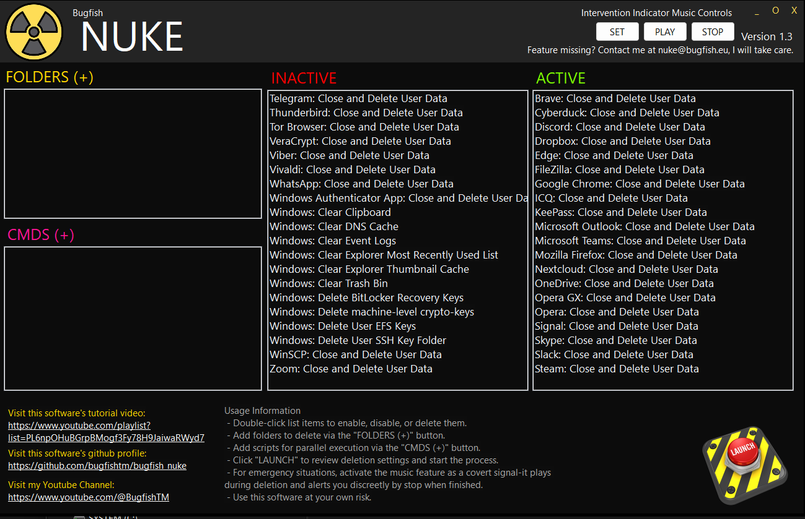

# Bugfish Nuke

Bugfish Nuke: Instant, Secure Data Erasure When It Matters Most.

-----------

## Introduction

Bugfish Nuke is a powerful emergency data deletion tool for Windows, designed to help you quickly and securely erase sensitive files, user data, and system traces. Whether you need to protect your privacy or respond to a critical situation, Bugfish Nuke offers fast, configurable, and reliable data destruction. |

## Features

- Instantly erase user data, application traces, and sensitive files in a single click.
- Secure deletion: Files are overwritten, not just moved to the recycle bin.
- Clear clipboard contents
- Flush DNS cache
- Erase event logs
- Delete most recently used (MRU) lists
- Remove thumbnail caches
- Empty the recycle bin (system default)
- Set overwrite passes (1 or more) for each deletion:
	- 1 pass: Fast, effective for most cases
	- 3+ passes: Higher security, slower
	- **Warning:** 0 passes disables overwriting and is NOT recommended
- Add your own scripts (e.g., batch files) to run alongside the deletion process
- Example: Dismount VeraCrypt volumes automatically
- Optional: Corrupt Windows login files after deletion to prevent further access
	- **Use with caution:** This will render Windows unbootable and require reinstallation
- Play a custom or built-in music track during deletion
- Music stops when deletion is complete-useful as an audible signal if you step away
- Overview of selected actions before launch
- Settings for post-deletion behavior: auto-close, force restart, etc.
- Direct links to tutorials and help resources

## Security Notes

- **Overwriting:** Files are overwritten according to your settings, making recovery nearly impossible.
- **Recycle Bin:** Emptied using Windows default; secure overwrite for the bin may be added in future versions.
- **Custom Scripts:** Scripts run independently and can be used to automate additional emergency tasks.
- **File Deletion:** Files are securely overwritten (unless you set passes to 0), making recovery extremely unlikely.
- **Music Player:** It provides an audible signal when the deletion process is finished, useful if you need to leave your computer during an emergency wipe.
- **Use with Caution:** Bugfish Nuke is designed for emergency situations. Use with care, especially the destructive system options.

> **Warning:** Use the "Corrupt Windows System" option only in extreme situations. This action is irreversible and will require a full system reinstall.

-----------

-----------

## Screenshots  
Check out our [Screenshots Gallery](./screenshots.html) for a visual overview of the project. You’ll find images showcasing key features and user interface design, offering a preview of what to expect.

-----------

## Tutorials  
Visit the [Tutorials Page](./tutorials.html) for a collection of step-by-step guides that will help you get the most out of the project. These tutorials cover everything from installation to advanced functionality.

-----------

## Downloads  
The [Downloads Section](./download.html) provides all the necessary files to get started with the project, including the latest software versions and any related resources.

-----------

## Installation  
Follow the clear and detailed instructions in our [Installation Guide](./installation.html) to set up the project. This guide will help you get everything running smoothly on your system.

-----------

## Contributing  
Find out how you can contribute to the project by visiting the [Contributing Page](./contributing.html). Whether you want to report bugs, suggest features, or submit improvements, we welcome your involvement.

-----------

## Warranty  
Review the terms of our warranty on the [Warranty Information Page](./warranty.html). This page outlines the scope of support and any applicable guarantees.

-----------

## Support  
If you need assistance, visit the [Support Page](./support.html) to find the available channels for getting help with any issues or questions you might have.

-----------

## License  
Get the full details on licensing by checking out the [License Information Page](./license.html). This section includes the terms and conditions under which the project is distributed.